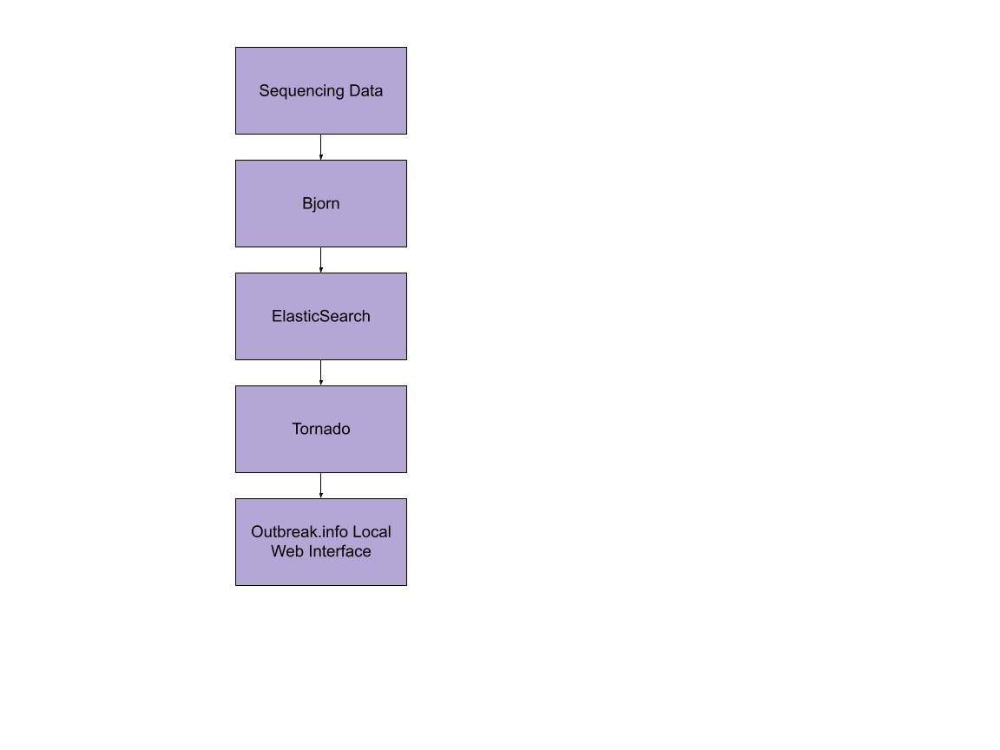

Welcome to Outbreak Local's Documentation!
==========================================

Outbreak.info Local is an offshoot project from `Outbreak.info <https://outbreak.info/>`_, which originated in the Su, Wu, 
and Andersen labs at Scripps Research. The goal of Outbreak.info Local is to allow researchers to use the outbreak.info
visualizations for genomic variants to explore SARS-CoV-2 data from customizable data sources.

Using `tornado <https://www.tornadoweb.org/en/stable/>`_,  and `elasticsearch <https://www.elastic.co/>`_ users can turn their
sequnces in to a website and api for original data analysis.

How it Works Overview
----------------------

1. Format sequencing data to match the `Andersen Lab <https://github.com/andersen-lab/HCoV-19-Genomics>`
2. 

Check out how to :doc:`install` the project.

.. note::

   This project is under active development.

Contents
--------

.. toctree::

   install
   docker-commands
   parameters
