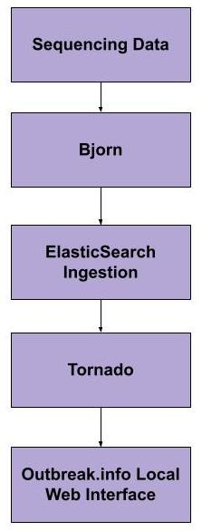

Welcome to Outbreak Local's Documentation!
==========================================

Outbreak.info Local is an offshoot project from `Outbreak.info <https://outbreak.info/>`_, which originated in the Su, Wu, 
and Andersen labs at Scripps Research. The goal of Outbreak.info Local is to allow researchers to use the outbreak.info
visualizations for genomic variants to explore SARS-CoV-2 data from customizable data sources.

Using `Tornado <https://www.tornadoweb.org/en/stable/>`_,  and `ElasticSearch <https://www.elastic.co/>`_ users can turn their
sequnces in to a website and api for original data analysis. The process is dockerized to make it as simple as possible.

How it Works Overview
----------------------

|pic1| |text1|

.. |text1| code-block:: console
    :width: 50%

    1. Sequencing data is pre-proccessed using the tool `bjorn <https://github.com/andersen-lab/bjorn>`_. 
    2. Pre-processed data is ingested into ElasticSearch.
    3. Tornado server goes up, allowing API access to data.
    4. Outbreak.info local web application builds and the client side goes up.

Each of the boxes in the above figure represent a containerized docker process (except for the 'Sequencing Data') that can be run via the project Makefile.

Check out how to :doc:`install` the project.

.. note::

   This project is under active development.

Contents
--------

.. toctree::

   install
   getting-started
   docker-commands
   parameters-and-data-formatting
   new-features
   troubleshooting
