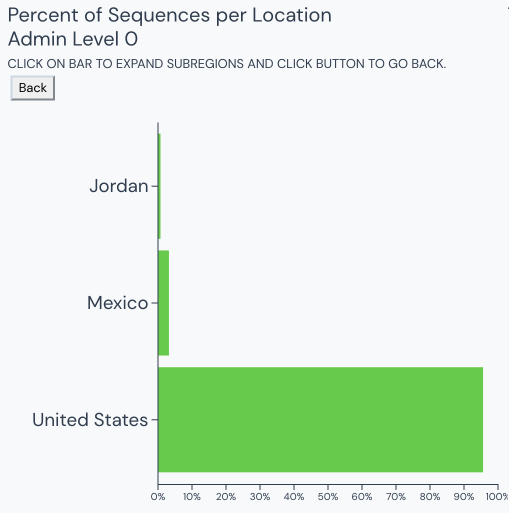
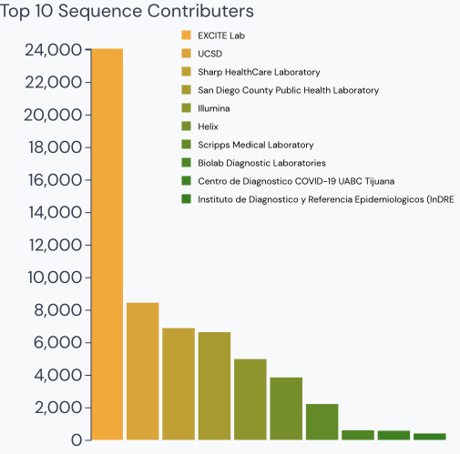
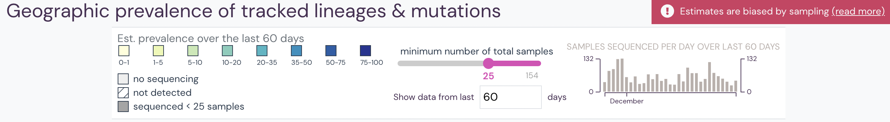
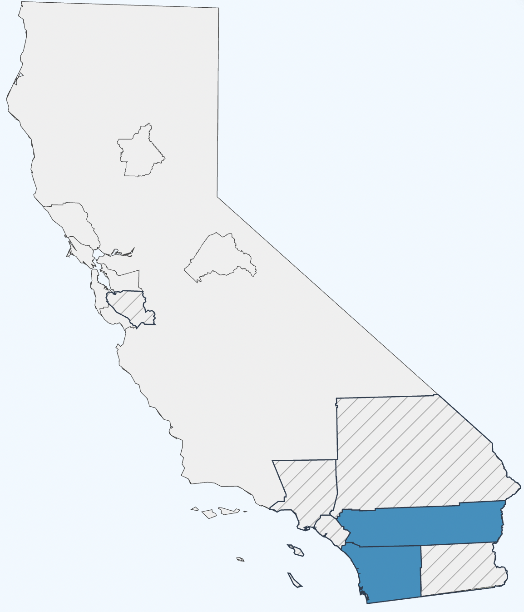
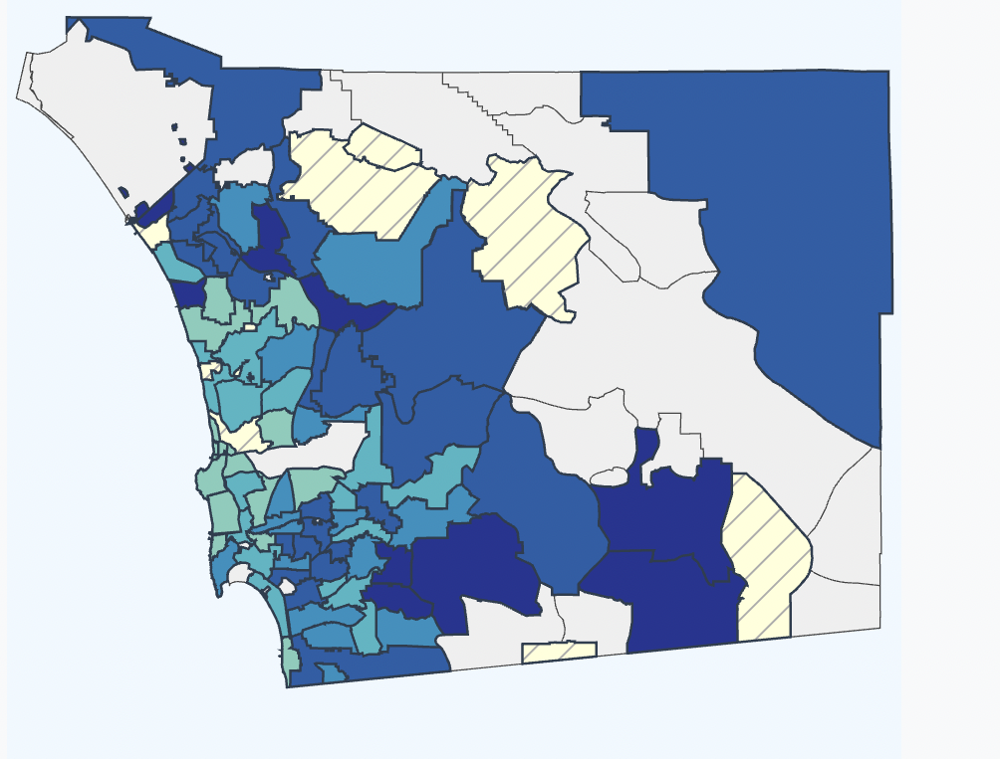

New Features
============

Outbreak.network contains several features not present in it's parent project.

Data Explorer
-------------

In order to help the user explore the contents of the custom database, we have developed an interactive barchart displaying the origin locations of data by admin level.

    :width: 75%
    Figure 1. Barchart of data by admin level 0 in the Andersen lab build as of Mar. 2022.

Sequencer Acknowledgements 
--------------------------

Sequencers are and important part of tracking outbreaks. The additional homepage barchart of outbreak.network displays the top ten sequencer contributions to the build.

    :width: 75%
    Figure 2. Barchart showing top ten sequencers contibuting the Andersen lab build as of Mar. 2022

Epidemiology Data Inclusion
---------------------------

County Level Choropleth
-----------------------

One new feature that has been added is the visualization of county level prevalence choropleths (admin level 2). This adjustment is automatic
and will be done for every county of every country with data included in the ElasticSearch ingestion process.

    :width: 75%
    Figure 4. Delta prevalence in California as of Jan. 2022.

Zipcode Level Choropleth
------------------------

Similarly, zipcode choropleth support for prevlaence choropleths

    

    :width: 75%
    Figure 5. Delta prevalence in San Diego County as of Jan. 2022.
